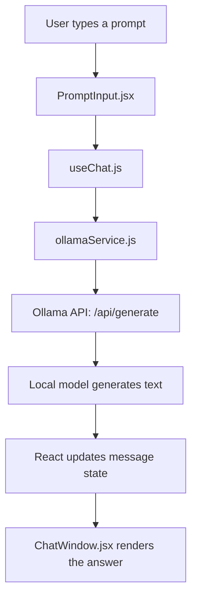

# react-ollama-local-llm-tutorial

A beginner-friendly React.js tutorial project that shows how to connect a modern web UI to a **local LLM running in Ollama**.

This repository is educational first and feature-rich second. Every major file contains comments that explain the React, API, and local AI concepts behind the implementation.

## What is Ollama?

Ollama is a local runtime for large language models (LLMs). It lets you download models such as `llama3`, `mistral`, and `qwen`, then interact with them through a local command line interface and a local REST API.

Ollama's native endpoint is:

```txt
http://localhost:11434/api/generate
```

This tutorial routes browser requests through the Vite dev server proxy, so the React app actually calls:

```txt
/ollama/api/generate
```

and Vite forwards that request to `http://localhost:11434/api/generate` without needing a cloud API key.

## Why run LLMs locally?

Local AI development is useful because it offers:

- **Privacy** – your prompts and responses stay on your own machine
- **No API costs** – no token billing for experiments
- **Offline development** – keep building without internet access
- **Fast experimentation** – swap prompts and models quickly

## Learning objectives

By exploring this repository, developers should learn:

1. What Ollama is
2. How local LLMs work
3. How React communicates with APIs
4. How prompts are sent to an LLM
5. How responses are returned (and how streaming differs)
6. Basic prompt engineering concepts
7. Error handling with AI integrations
8. Local AI application architecture

## Project structure

```txt
src/
├── components/
│   ├── ChatWindow.jsx
│   ├── Message.jsx
│   └── PromptInput.jsx
├── hooks/
│   └── useChat.js
├── services/
│   └── ollamaService.js
├── utils/
│   └── constants.js
├── App.css
├── App.jsx
├── index.css
├── main.jsx
```

## Prerequisites

- Node.js 20.19+ or 22.12+
- Ollama installed locally

## Install Ollama

### macOS

```bash
brew install ollama
```

### Windows

Download Ollama from the official site:

```txt
https://ollama.com/download
```

Install it with the Windows installer, then open a terminal after setup completes.

### Linux

```bash
curl -fsSL https://ollama.com/install.sh | sh
```

## Start Ollama

```bash
ollama serve
```

Keep this terminal running while your React app is making requests.

## Why the Vite proxy matters

If your React app tries to call `http://localhost:11434` directly from the browser, the request can fail because the browser treats it as a cross-origin request.

This repository avoids that beginner pain point by using a Vite development proxy:

```txt
Browser -> http://localhost:5173/ollama/api/generate
Vite proxy -> http://localhost:11434/api/generate
```

That means you usually do **not** need to configure Ollama CORS manually for local development with this project.

## Download a model

Example using `llama3`:

```bash
ollama pull llama3
```

You can also try:

```bash
ollama pull mistral
ollama pull qwen
```

Verify the installed models:

```bash
ollama list
```

## Install project dependencies

```bash
npm install
```

## Start the development server

```bash
npm run dev
```

Vite will print a local URL similar to:

```txt
Local:   http://localhost:5173/
```

## Verify the integration

1. Start Ollama with `ollama serve`
2. Download a model such as `llama3`
3. Run the React app with `npm run dev`
4. Open the Vite URL in your browser
5. Send a prompt such as:

```txt
Explain React hooks simply.
```

Expected behavior:

- Your message appears in the chat history
- The send button shows a loading state
- The app sends a POST request to Ollama
- An assistant message appears with the generated response

Example browser console / network expectations:

```txt
POST http://localhost:5173/ollama/api/generate 200 OK
Request body: {"model":"llama3","prompt":"You are a senior React engineer who explains concepts to beginners.\n\nUser: Explain React hooks simply.","stream":false,"options":{"temperature":0.7}}
```

Expected UI sections:

- A tutorial header
- A chat history area
- A prompt textarea
- A model selector
- Error feedback if Ollama is unavailable

## How AI requests work

```txt
User Input
   ↓
React UI
   ↓
API Client
   ↓
Ollama Server
   ↓
LLM Model
   ↓
Generated Response
   ↓
React UI Update
```

### Architecture walkthrough



## Ollama integration basics

This project calls the Ollama REST API with `fetch()`:

```js
const response = await fetch('/ollama/api/generate', {
  method: 'POST',
  headers: {
    'Content-Type': 'application/json',
  },
  body: JSON.stringify({
    model: 'llama3',
    prompt:
      'You are a senior React engineer who explains concepts to beginners.\n\nUser: Explain React hooks simply',
    stream: false,
    options: {
      temperature: 0.7,
    },
  }),
})
```

Example models:

- `llama3`
- `mistral`
- `qwen`

To change the default model for the app, edit:

```txt
src/utils/constants.js
```

## System prompts

System prompts help shape the tone or role of the model.

Example:

```txt
You are a senior React engineer who explains concepts to beginners.
```

In this tutorial, the hook sends a beginner-friendly instruction before the user prompt so learners can see how prompt context affects output.

## Temperature

Temperature controls creativity.

- **Lower temperature** (for example `0.2`) usually gives more predictable answers
- **Higher temperature** (for example `0.9`) can produce more creative or varied answers

Example payload:

```js
{
  model: 'llama3',
  prompt: 'Explain React hooks simply',
  stream: false,
  options: {
    temperature: 0.7,
  },
}
```

## Streaming responses

This tutorial keeps the main implementation simple by using:

```js
stream: false
```

That means Ollama waits until the full response is ready and then returns one JSON object.

If you want to teach streaming later, you can switch to:

```js
stream: true
```

and read the response incrementally.

Example concept:

```js
const response = await fetch('http://localhost:11434/api/generate', {
  method: 'POST',
  headers: { 'Content-Type': 'application/json' },
  body: JSON.stringify({
    model: 'llama3',
    prompt: 'Teach me React state step by step.',
    stream: true,
  }),
})

const reader = response.body.getReader()
const decoder = new TextDecoder()

while (true) {
  const { done, value } = await reader.read()
  if (done) break

  const chunk = decoder.decode(value)
  console.log(chunk)
}
```

## Error handling

This project teaches how to handle:

- **Ollama not running** – show a clear message telling the user to start `ollama serve`
- **Model not installed** – explain how to run `ollama pull <model-name>`
- **Network issues** – catch fetch errors and show a friendly fallback
- **CORS / browser access issues** – avoid them in development by using the included Vite proxy
- **Empty prompts** – validate the input before calling the API

## Best practices

- Validate prompts before sending requests
- Keep input handling simple and predictable
- Show loading indicators during generation
- Log or inspect network requests during development
- Store API logic in reusable service files
- Keep UI components focused on rendering responsibilities

## Application features

The tutorial app includes:

- User input textbox
- Send button
- Message history
- User messages
- Assistant messages
- Loading state
- Error state
- Easily changeable model selection

## Stretch goals

If you want to extend this tutorial, try adding:

- Conversation memory
- Multiple model selection enhancements
- Chat export
- Markdown rendering
- Syntax-highlighted code blocks
- A simple RAG integration example

## Development notes

- The UI is intentionally simple so the Ollama integration is easy to understand
- The codebase uses JavaScript instead of TypeScript for beginner accessibility
- Comments throughout the source explain hooks, state management, async/await, prompt construction, and error handling
